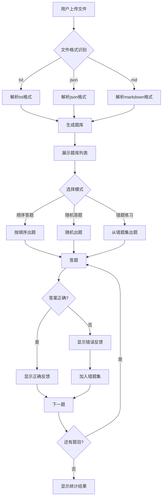

## 1. Product Overview
一个题库刷题小程序，支持从各种文件格式（txt、json、markdown）导入题目，提供刷题练习、错题集管理、答题统计等功能，帮助用户高效学习和备考。

## 2. Core Features

### 2.1 Feature Module
1. **首页/题库列表**：展示所有题库，支持添加新题库
2. **题目导入**：支持从txt、json、markdown文件导入题目
3. **刷题模式**：顺序答题、随机答题、错题练习
4. **错题集**：自动收集错题，支持复习和删除
5. **答题统计**：正确率、答题数、知识点分布

### 2.2 Page Details
| Page Name | Module Name | Feature description |
|-----------|-------------|---------------------|
| Home | 题库列表 | 展示所有题库卡片，支持添加、删除、进入刷题 |
| Home | 文件导入 | 上传文件解析题目，支持txt、json、markdown格式 |
| Practice | 答题界面 | 显示题目内容、选项，支持单选/多选，即时反馈 |
| Practice | 答题模式 | 顺序答题、随机答题、错题模式切换 |
| WrongBook | 错题列表 | 展示所有错题，支持复习和删除 |
| Stats | 统计面板 | 正确率、答题数、知识点分析 |

## 3. Core Process
用户导入文件 → 系统解析题目 → 生成题库 → 用户选择刷题模式 → 答题 → 查看结果 → 错题自动收集 → 复习错题

## 4. User Interface Design

### 4.1 Design Style
- 主色调：深蓝色 (#1e40af) 配合青色 (#06b6d4)
- 按钮风格：圆角矩形，悬停有阴影效果
- 字体：标题使用 Inter Bold，正文使用 Inter Regular
- 布局：卡片式布局，清晰的信息层级
- 图标：使用 lucide-react 图标库

### 4.2 Page Design Overview
| Page Name | Module Name | UI Elements |
|-----------|-------------|-------------|
| Home | 顶部导航 | Logo、标题、统计入口 |
| Home | 题库卡片 | 题库名称、题目数量、操作按钮 |
| Home | 导入区域 | 文件上传按钮、格式说明 |
| Practice | 题目卡片 | 题目类型、内容、选项列表 |
| Practice | 答题控制 | 模式切换、进度条、提交按钮 |
| WrongBook | 错题列表 | 题目摘要、错误次数、操作按钮 |
| Stats | 统计卡片 | 正确率圆环图、数据指标、趋势图 |

### 4.3 Responsiveness
- 移动端优先设计
- 使用 Tailwind CSS 响应式类
- 触摸优化的按钮尺寸（最小 44px）

### 4.4 Question Types Support
- 单选题：题目 + 多个选项 + 一个正确答案
- 多选题：题目 + 多个选项 + 多个正确答案
- 判断题：题目 + 对/错选项
- 填空题：题目 + 答案