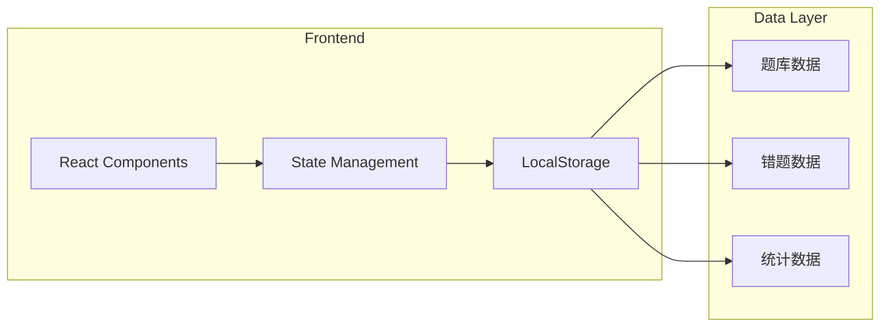
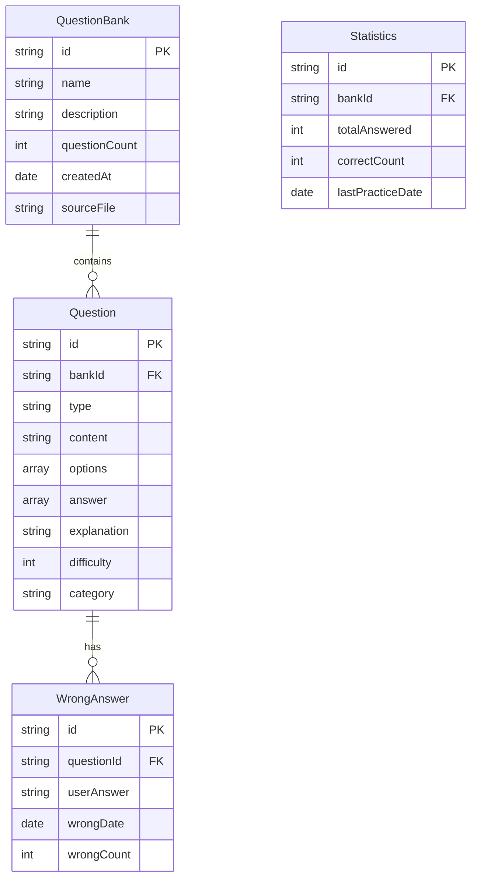

## 1. Architecture Design


## 2. Technology Description
- Frontend: React@18 + TypeScript + tailwindcss@3 + vite
- Initialization Tool: vite-init
- State Management: Zustand
- Icons: lucide-react
- Data Storage: LocalStorage

## 3. Route Definitions
| Route | Purpose |
|-------|---------|
| / | 首页，题库列表和文件导入 |
| /practice/:id | 刷题页面，根据题库ID答题 |
| /wrong | 错题集页面 |
| /stats | 统计页面 |

## 4. Data Model

### 4.1 Data Model Definition


### 4.2 Question Types
| Type | Description | Example |
|------|-------------|---------|
| single | 单选题 | A. 选项一 |
| multiple | 多选题 | A. 选项一, B. 选项二 |
| judge | 判断题 | 正确/错误 |
| fill | 填空题 | 答案：xxx |

### 4.3 File Format Support

**TXT格式示例:**
```
1. 题目内容？
A. 选项一
B. 选项二
C. 选项三
D. 选项四
答案：A

2. 第二题内容？
A. 选项一
B. 选项二
答案：B
```

**JSON格式示例:**
```json
[
  {
    "type": "single",
    "content": "题目内容",
    "options": ["A. 选项一", "B. 选项二"],
    "answer": ["A"],
    "explanation": "解析内容"
  }
]
```

**Markdown格式示例:**
```markdown
## 题目1
题目内容？

- A. 选项一
- B. 选项二
- C. 选项三

**答案**: A
**解析**: 解析内容
```

## 5. Component Structure
```
src/
├── components/
│   ├── Layout/
│   │   └── Header.tsx
│   ├── Bank/
│   │   ├── BankCard.tsx
│   │   ├── BankList.tsx
│   │   └── BankForm.tsx
│   ├── Import/
│   │   ├── FileUploader.tsx
│   │   └── FormatPreview.tsx
│   ├── Practice/
│   │   ├── QuestionCard.tsx
│   │   ├── OptionList.tsx
│   │   ├── ProgressBar.tsx
│   │   └── ResultModal.tsx
│   ├── Wrong/
│   │   └── WrongList.tsx
│   └── Stats/
│       ├── StatCard.tsx
│       └── AccuracyChart.tsx
├── pages/
│   ├── Home.tsx
│   ├── Practice.tsx
│   ├── WrongBook.tsx
│   └── Stats.tsx
├── stores/
│   ├── bankStore.ts
│   ├── practiceStore.ts
│   └── statsStore.ts
├── utils/
│   ├── parser.ts
│   ├── storage.ts
│   └── types.ts
└── App.tsx
```

## 6. State Management

### Bank Store (zustand)
- banks: QuestionBank[] - 所有题库列表
- currentBank: QuestionBank | null - 当前选中的题库
- addBank(bank): void - 添加题库
- deleteBank(id): void - 删除题库
- selectBank(id): void - 选择题库

### Practice Store (zustand)
- questions: Question[] - 当前题目列表
- currentIndex: number - 当前题目索引
- mode: 'sequential' | 'random' | 'wrong' - 答题模式
- userAnswers: Record<string, string[]> - 用户答案
- isSubmitted: boolean - 是否已提交
- startPractice(bankId, mode): void - 开始练习
- submitAnswer(questionId, answer): void - 提交答案
- nextQuestion(): void - 下一题

### Stats Store (zustand)
- statistics: Statistics[] - 统计数据
- wrongAnswers: WrongAnswer[] - 错题列表
- recordAnswer(bankId, questionId, isCorrect, userAnswer): void - 记录答题
- getStats(bankId): Statistics - 获取统计
- getWrongQuestions(): Question[] - 获取错题